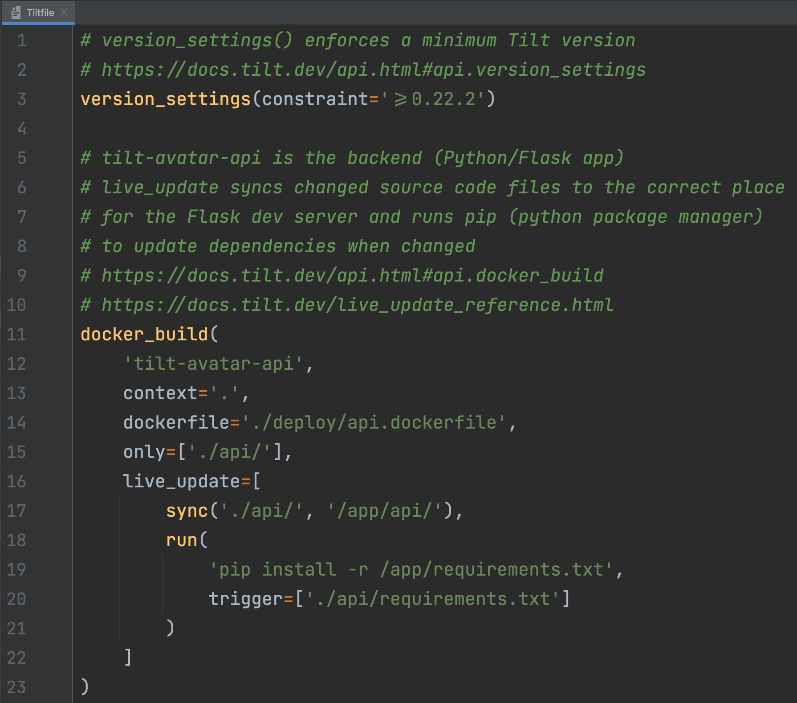

# Tiltfile TextMate Bundle

Add syntax highlighting for your `Tiltfile` in editors that support TextMate bundles.

Popular editors that support TextMate bundles for syntax highlighting include the JetBrains family of IDEs and more!

## Install / Use

## JetBrains IDEs (IntelliJ / GoLand / PyCharm / WebStorm)

The process might vary slightly from one JetBrains IDE to another.

JetBrains has official IDE-specific instructions:

* [IntelliJ IDEA](https://www.jetbrains.com/help/idea/textmate.html)
* [GoLand](https://www.jetbrains.com/help/go/tutorial-using-textmate-bundles.html)
* [PyCharm](https://www.jetbrains.com/help/pycharm/tutorial-using-textmate-bundles.html)
* [WebStorm](https://www.jetbrains.com/help/webstorm/tutorial-using-textmate-bundles.html)

In general, the process is as follows:

1. Download `Tiltfile.tmBundle`
    * Option 1: `git clone https://github.com/tilt-dev/tiltfile.tmbundle`
    * Option 2: [Download ZIP][src-zip-download] and extract
1. Open the **Settings/Preferences** dialog (`⌘ ,` on macOS, `Ctrl-Alt-S` on Windows) and select **Editor | TextMate Bundles**
1. Click the **+** button and select the path to `tiltfile.tmbundle` directory
1. Click **OK** to apply the changes
1. Open a `Tiltfile` and enjoy ✨

## Acknowledgements

The TextMate grammar was originally written for Python by MagicStack.

It was adapted for Starlark (the language used in a `Tiltfile`) by the Bazel team for the [vscode-bazel][] extension.

The grammar has been converted from JSON to XML/plist using the [TextMate Languages][vscode-textmate-languages] extension.

[src-zip-download]: https://github.com/tilt-dev/tiltfile.tmbundle/archive/refs/heads/main.zip
[vscode-bazel]: https://github.com/bazelbuild/vscode-bazel/tree/ffd1450a4222825db11533aac5f5c7aa51ef50eb/syntaxes
[vscode-textmate-languages]: https://marketplace.visualstudio.com/items?itemName=pedro-w.tmlanguage
